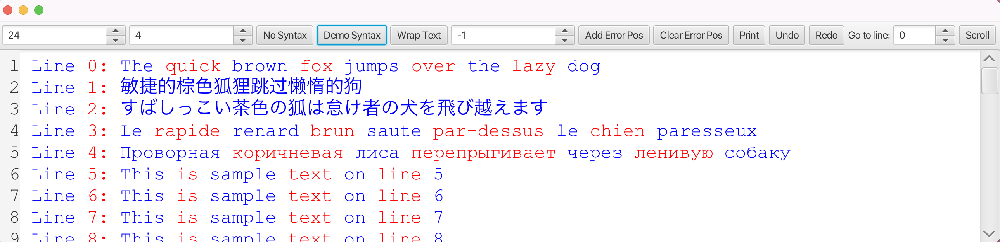

## General
This component provides a code area with syntax highlighting capabilities. It is designed to enhance the readability of code snippets by applying various styles and colors based on the programming language syntax.

It is based on TextArea component of JavaFX 23.

According to Open Source Initiative (OSI), the code is licensed under the GPL-2.0 License.

## TODO
- [x] Syntax Highlighting Interface
  - [x] Support Color Scheme
  - [x] Support Highlighting Words
  - [x] Support Underline
  - [x] Support Highlighting Quotes

## Tools Powered By this Component
* [SQLife](http://bitifyware.com)