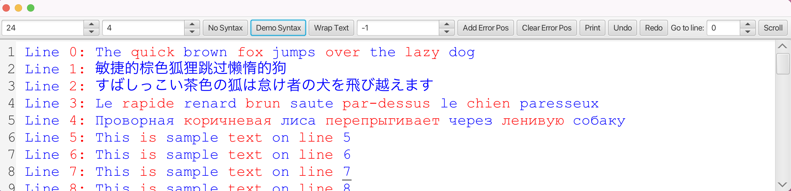

## General
This component provides a code area with syntax highlighting capabilities. It is designed to enhance the readability of code snippets by applying various styles and colors based on the programming language syntax.

It is based on TextArea component of JavaFX 23.

According to Open Source Initiative (OSI), the code is licensed under the GPL-2.0 License.



## Disk cache and viewport rendering (Java 21+)

`new CodeArea(text, true)` now uses `InCacheContent`; `InDiskContent` remains
available for compatibility. For files too large to first load into a String:

```java
// Load on a worker thread, then transfer sole ownership to the FX thread.
InCacheContent content;
try (Reader reader = Files.newBufferedReader(path, StandardCharsets.UTF_8)) {
    content = new InCacheContent(reader);
}
// On the FX application thread:
CodeArea editor = CodeArea.fromCache(content);
// When permanently closing the editor, remove it from the scene first:
editor.closeContent();
```

The private UTF-16 cache uses `FileChannel.map(..., Arena)` and FFM-owned memory
segments in 1 MiB regions. Reflection is limited to the FFM API boundary because
the same API is preview in JDK 21 and final in JDK 22+. There is no legacy mapped
buffer/Unsafe fallback and no preview bytecode or application-wide preview flag.
Closing releases the arenas/mappings before deleting the temporary file; a
Cleaner provides fallback cleanup. The file is a disposable cache, not a saved
document or a recovery journal. Readers use the same filtering as InMemoryContent
(including removal of CR/control characters, preserving LF, tabs and UTF-16).

The skin retains only viewport paragraphs plus eight paragraphs of overscan on
each side, and reuses nodes in overlapping windows. Line numbers, selection,
diff decorations and hit testing use document indices. Offscreen text is not
syntax-decomposed. Geometry is indexed independently of the scene graph.

### Limits and tradeoffs

* The existing API uses `int` UTF-16 positions (at most `Integer.MAX_VALUE`
  characters), not arbitrary-size 64-bit document positions.
* Paragraph descriptors/position and height indices remain O(number of lines)
  heap metadata. Edits currently rebuild position metadata in O(number of lines),
  but write only affected text. A tree/paged index is a future improvement for
  millions of lines and frequent edits.
* The append-only cache grows with edits; obsolete records are reclaimed on
  close. Compaction, crash recovery and persistence are not implemented.
* `getText()`, text-property **change** listeners/bindings, selecting/copying very
  large ranges, undo history and formatters can still
  materialize large Strings. The internal length/prompt/decoration invalidation
  and ordinary viewport rendering no longer request the whole document.
* Wrapped offscreen heights are estimates, refined as paragraphs are measured.
  The scrollbar extent can change while scrolling; unwrapped heights are exact.
  Horizontal extent grows as wider lines are encountered, rather than scanning
  and shaping every line up front.
* Virtualization is paragraph-granular: one exceptionally long line still needs
  its own String/text nodes (including all its wrapped rows). True visual-row or
  horizontal virtualization would require a separate text-layout strategy.
* Mouse column selection shapes selected offscreen paragraphs on demand without
  retaining their nodes; very large rectangles can therefore still be expensive.
  Bracket/word occurrence highlights search the rendered window, not the entire
  file. Offscreen character bounds are estimated until brought into view.
* Editing, paragraph lists and JavaFX properties remain single-owner/FX-thread
  operations. Independent text/search cursors can read on worker threads using
  short synchronized reads. Do not close content on skin replacement: a
  replacement skin still needs the model.

## Cursor APIs (callers may migrate incrementally)
Wrapped-height measurements preserve the visible paragraph and its pixel offset,
including when preceding overscan paragraphs replace estimated heights. The
scrollbar ratio is synchronized after its content-size cache has updated, rather
than feeding size-driven ratio changes back as user scrolls.
Measured wrapped heights are retained across geometry invalidation (font, wrap,
width, empty-line changes) as long as the paragraph set is unchanged; only an
actual document structure change resets them to the single-line estimate.
Discarding them collapsed the extent and re-grew it while scrolling, which
repeatedly adjusted the anchor and cancelled small scroll steps.
Scrolling uses the same snapped/cached extent as ScrollPaneSkin, exposed through
its vertical scrollbar's visible amount, rather than the text child's preferred
height. Changes in both the scrolling HBox bounds and the scrollbar extent schedule
post-layout synchronization. There is no numerical ratio-conversion heuristic;
layout-only updates cannot override the anchor while synchronization is queued,
but actual wheel events and vertical scrollbar gestures remain accepted. The
gutter extent updates together with measured text height. Bottom-of-document
scrolling retains the bottom when new wrapped heights are measured.


All existing String/paragraph APIs remain available. The following additive APIs
are exposed by CodeInputControl/CodeArea and by the supplied content models:

```java
editor.addContentChangeListener(change -> {
    // change.version(), start(), removedLength(), insertedLength(); no full text.
    // Delivered on the editing thread, after storage/indices are consistent.
});
long version = editor.getContentVersion();

try (TextCursor text = editor.openCursor(caretPosition)) {
    int unit = text.next();             // UTF-16 unit, or -1 at EOF
    text.previous();
    text.seek(0);                      // absolute document position
    text.read(buffer, 0, buffer.length);
    CharSequence lazy = text.asCharSequence();
    CharacterIterator iterator = text.asCharacterIterator();
}

SearchQuery query = new SearchQuery("needle", false, true, false, true);
SearchCursor matches = editor.search(query, 0, editor.getLength(), caretPosition);
Optional<IndexRange> next = matches.next();
Optional<IndexRange> previous = matches.previous();
SearchCount total = matches.countAsync(); // separate bounded daemon worker pool
// total.result().state() == UNKNOWN -> display '?'; no zero/partial guess.
total.completion().thenAccept(ignored -> Platform.runLater(() -> {
    SearchCount.Result current = total.result(); // recheck after FX dispatch
    // COMPLETE: current.count(); STALE: discard/restart for the new version.
}));
// When replacing the query/closing its UI, close total and matches.

editor.writeTo(writer);                 // never closes/flushes the caller's writer
```

* Each cursor buffers at most 4,096 UTF-16 units (8 KiB of character data) and a
  captured document version; `fork()`
  creates an independent cursor. Cursor instances themselves are thread-confined.
  InMemoryContent indexes paragraph starts lazily; InCacheContent uses its mapped
  paragraph index. Neither implementation rescans preceding text per block.
* A model monitor serializes each bounded block read with editing/unmapping,
  without holding the lock for an entire search or file write. Edits invalidate
  old cursors (`ConcurrentModificationException`), including edits that suppress
  the original text-property notification. Closing content invalidates readers.
  A cursor is **not** an immutable snapshot. Copy/edit/close on FX, and transfer
  independent read cursors to workers. Do not wait for workers inside edit events.
* `ContentChange` notifications describe individual storage edits, even when
  `notifyListeners=false`; a replacement may report delete and insert separately.
  Empty edits do not change the version. Add/remove listeners symmetrically when
  disposing a caller. Plain invalidation listeners no longer read text merely
  when registered; old String change listeners still behave as before.
* Literal search uses KMP across blocks/paragraphs in both directions. Matches are
  non-overlapping during each traversal; changing direction skips the current
  match. Backward literals select the nearest match ending before the position.
  Case-insensitive literals use simple UTF-16 case folding; whole-word checks use
  Unicode letters/digits/combining marks/connectors. Positions remain UTF-16.
* Regex uses Matcher over the lazy document view, retaining cross-line matches,
  lookaround, captures/backreferences and document-relative anchors. Scope limits
  matches, while transparent bounds permit lookaround outside the scope. Zero-
  length results advance to avoid loops. Backward regex scanning uses forward
  matching through the scope and retains only its last acceptable match; this can
  be expensive. Backtracking stack/time are **not** guaranteed bounded.
* Counts start UNKNOWN unless already completed, and never retain match lists.
  States are UNKNOWN/COMPLETE/STALE/CANCELLED/FAILED. `countAsync(Executor)` permits
  a caller-owned worker executor. Cancellation/interruption is cooperative,
  including checks during regex character access; there is no hard regex timeout.
  Completion callbacks may run off the FX thread or on the registering thread;
  dispatch to FX and call `result()` again before displaying it. Completed counts
  also become STALE after an edit. Query replacement should close old count tasks.
* Streamed output fails fast on concurrent edits and can leave partial output.
  Future file-saving callers should write to a temporary file and publish only
  after successful completion. This API does not make saving atomic by itself.
* Core character/word navigation and deletion now pass cursor-backed
  CharacterIterators to BreakIterator instead of concatenating the document.
  String formatters/accessibility remain compatible. Line operations now use
  paragraph offsets and read only affected ranges. `loadText(Reader)` performs
  FX-thread bulk loading without per-chunk undo history, while leaving the reader
  open; input failure can leave partial text, so callers should validate input
  first. It requires unbound text without a TextFormatter. `TextCursor.asReader()`
  adapts a cursor and closes only that cursor when the Reader is closed.

Desktop callers now use cursors for Finder, current SQL statement lookup and
indentation conversion, streaming file/recovery output and checksums, and indexed
caret locations. Finder displays '?' until its asynchronous total is complete.
Replace-all spools original ranges to temporary disk storage and applies edits
backwards, avoiding heap-sized match lists and re-matching inserted replacement
text. Formatting, full-script execution, cell value updates and dialect outline
parsing still use Strings required by their existing APIs; outline parsing reads
on a worker after debounce and rejects results from old content versions.

## TODO
- [x] Syntax Highlighting Interface
  - [x] Support Color Scheme
  - [x] Support Highlighting Words
  - [x] Support Underline
  - [x] Support Highlighting Quotes
  - [x] Support Red/Green Empty Lines

## Tools Powered By this Component
* [SQLife](http://bitifyware.com)
